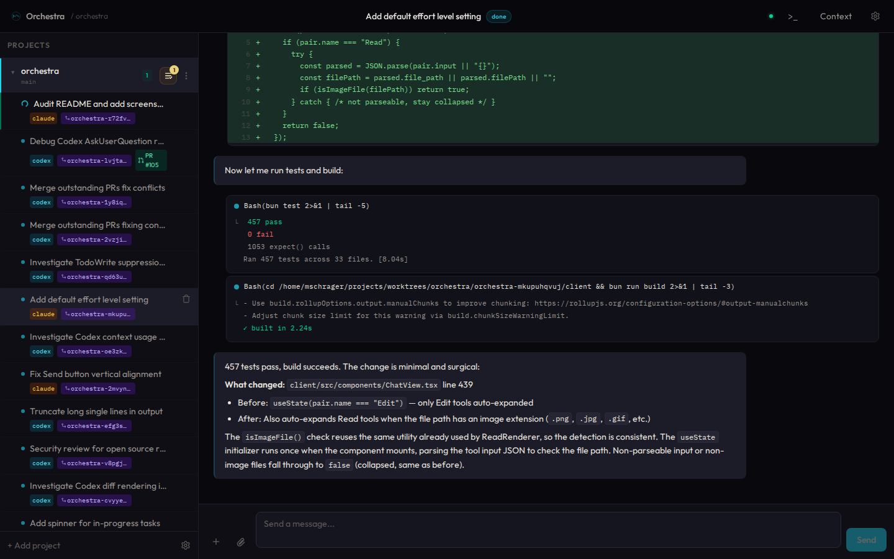
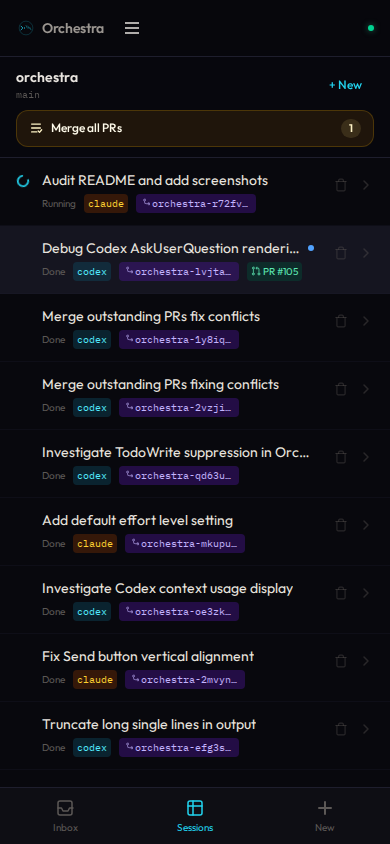
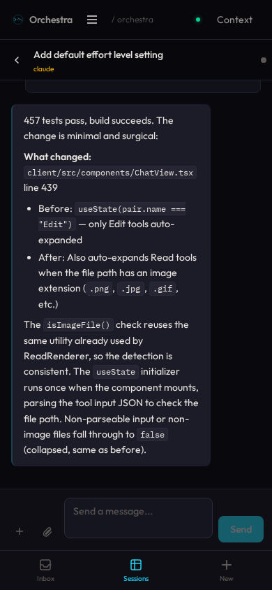

# Orchestra

The missing conductor for your local agent CLIs. Orchestra gives your existing agents (Claude Code, Codex, etc.) a web/mobile interface with thread management, git worktree isolation, and one-click PR creation.

<p>
  
</p>

<details>
<summary>Mobile UI</summary>
<p>
  
  &nbsp;&nbsp;
  
</p>
</details>

```
┌─────────────────────────────────────┐
│  Web / Mobile UI                    │
│  Thread sidebar ← Chat → Context   │
└──────────────┬──────────────────────┘
               │ WebSocket + REST
┌──────────────┴──────────────────────┐
│  Bun + Hono Server                  │
│  Sessions │ Worktrees │ Agents      │
└──────────────┬──────────────────────┘
               │ stdin/stdout
┌──────────────┴──────────────────────┐
│  claude  │  codex  │  (any CLI)     │
└─────────────────────────────────────┘
```

## Why Orchestra?

I wanted an agent dashboard that combined five things no existing tool offered together:

- **Project-organized agent sessions** — threads grouped by repo, not scattered across terminal tabs
- **Model agnostic** — bring your own CLI agent, not locked to one provider
- **Mobile access to local sessions** — monitor and steer agents from your phone while they run on your laptop
- **Seamless worktree isolation** — one click to isolate a thread into its own git worktree, with PR creation built in
- **Use your existing subscriptions** — runs local CLI agents so you can use flat-rate plans (like Claude Pro/Max) instead of paying per token via API

Existing tools were either tied to a single model, required per-token API billing, lacked mobile access, or didn't understand git workflows. Orchestra fills that gap.

## Features

- **Thread-based UX** — Manage agent conversations as threads with streaming output, inline Bash previews, collapsible tool blocks, and rich diffs
- **Remote/mobile access** — Use from your phone while agents run on your laptop, with push notifications for attention events
- **Git worktree isolation** — One-click isolation of a thread into its own worktree
- **PR creation** — Create PRs directly from worktree threads via `gh`, with live status badges
- **Multi-agent** — Bring your own CLIs; Claude Code and Codex adapters included, easy to add more
- **Integrated terminal** — xterm.js terminal per thread, backed by a real PTY on the server
- **Token auth** — Secure remote access with bearer token auth
- **PWA** — Installable on mobile for a native-app feel

## Prerequisites

- [Bun](https://bun.sh/) (runtime and package manager)
- [Git](https://git-scm.com/)
- At least one agent CLI installed:
  - [Claude Code](https://docs.anthropic.com/en/docs/claude-code) (`claude`) — requires a Claude Pro/Max subscription or API key
  - [Codex](https://github.com/openai/codex) (`codex`) — requires an OpenAI API key
- Optional:
  - [`gh`](https://cli.github.com/) — for PR creation from worktree threads
  - [`tailscale`](https://tailscale.com/) — for zero-config remote access
  - [`cloudflared`](https://developers.cloudflare.com/cloudflare-one/connections/connect-apps/) — for Cloudflare Tunnel access

## Quick start

```bash
# Install dependencies
bun install

# Build the frontend
cd client && bun run build && cd ..

# Start the server
bun run start
```

Open [http://localhost:3847](http://localhost:3847).

Register a project (point it at any git repo):

```bash
bun run server/src/cli.ts add ~/projects/my-repo
```

Or use the "Add a project" button in the UI.

## Development

```bash
# Terminal 1: backend with hot reload
bun run dev:server

# Terminal 2: frontend with HMR
bun run dev:client
```

The Vite dev server proxies API and WebSocket requests to the backend.

## Remote access

By default, Orchestra binds to `127.0.0.1` (localhost only). To enable remote access:

```bash
ORCHESTRA_HOST=0.0.0.0 bun run start
```

This generates a bearer token stored in `~/.orchestra/auth-token`.

- **LAN / Cloudflare Tunnel / SSH tunnel** — use the bearer token to sign in from other devices
- **Tailscale Serve browser access** — Orchestra bootstraps a short-lived `HttpOnly` session from Tailscale identity headers
- **Tagged-device or fallback Tailscale access** — still uses the bearer token

**Recommended setup:**
- **Tailscale** — zero-config VPN, works from anywhere
- **LAN** — accessible on local WiFi
- **Cloudflare Tunnel** — `bun run start -- --tunnel` (or manually: `cloudflared tunnel --url http://localhost:3847`)
- **SSH tunnel** — `ssh -L 3847:localhost:3847 <host>`

## CLI

```bash
bun run server/src/cli.ts serve              # Start the server (default)
bun run server/src/cli.ts serve --tunnel     # Start with Cloudflare Tunnel
bun run server/src/cli.ts add <path>         # Register a project (git repo)
bun run server/src/cli.ts auth show          # Show auth token
bun run server/src/cli.ts auth regenerate    # Generate new token
bun run server/src/cli.ts help               # Show help
```

## Environment variables

| Variable | Default | Description |
|----------|---------|-------------|
| `ORCHESTRA_HOST` | `127.0.0.1` | Bind address (`0.0.0.0` for remote access) |
| `ORCHESTRA_PORT` | `3847` | Server port |
| `ORCHESTRA_DATA_DIR` | `~/.orchestra` | Data directory (SQLite DB, auth token, uploads) |

## Tech stack

| Layer | Choice |
|-------|--------|
| Runtime | Bun |
| Backend | Hono |
| Frontend | React + Vite + Tailwind CSS |
| Database | SQLite (via Bun) |
| Package manager | Bun |

## Architecture

- **Server** (`server/`) — Hono API server with WebSocket support, SQLite persistence, agent process management, and worktree lifecycle
- **Client** (`client/`) — React SPA with streaming chat, thread sidebar, context panel, mobile-responsive layout
- **Shared** (`shared/`) — TypeScript types shared between server and client
- **Agent adapters** (`server/src/agents/`) — Thin wrappers that know how to spawn and parse output from each CLI agent

## License

MIT
